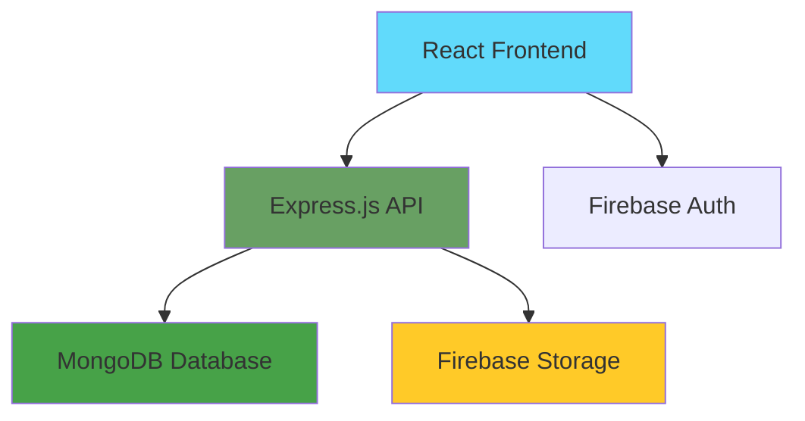
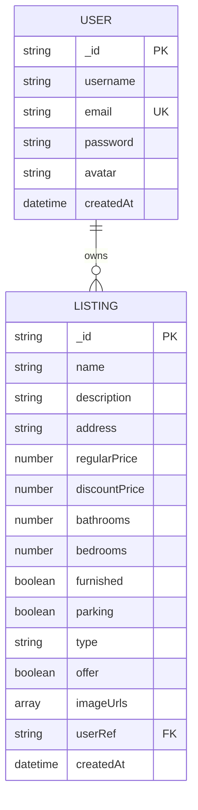

# 🏡 Real Estate MERN Application

A full-stack real estate web application built with the MERN stack that allows users to browse, search, and manage property listings with Google OAuth authentication and advanced search functionality.

## 📖 Project Overview

**Problem Statement:**
Traditional real estate platforms lack user-friendly interfaces and essential features like advanced search and secure authentication.

**Solution:**
A modern, responsive web application that connects property owners with potential buyers/renters through an intuitive interface with powerful search capabilities.

### Key Features
- 🔐 **Secure Authentication** - JWT-based auth with Google OAuth
- 🏠 **Property Management** - Full CRUD operations for listings
- 🔍 **Advanced Search** - Multi-criteria search and filtering
- 📱 **Responsive Design** - Mobile-first approach
- 🖼️ **Image Upload** - Multiple image support with cloud storage
- 💬 **Contact System** - Direct communication with property owners

## � Technology Stack

**Frontend:** React 18, Redux Toolkit, Tailwind CSS, Vite, Firebase Auth
**Backend:** Node.js, Express.js, MongoDB, Mongoose, JWT
**Deployment:** Vercel, MongoDB Atlas, Firebase Storage

## 🏗️ System Architecture



**Architecture:** 
- Frontend: React SPA with Redux state management
- Backend: Express.js REST API with JWT authentication
- Database: MongoDB for data storage
- Storage: Firebase for images and authentication

## 🗄️ Database Design (ERD)



**Main Collections:**
- **Users:** Store user authentication and profile data
- **Listings:** Store property information with user references
- **Relationship:** One user can own multiple property listings

## 🛠️ Installation & Setup

### Prerequisites
- Node.js (v18+)
- MongoDB
- Firebase Account

### Backend Setup
```bash
# Clone repository
git clone https://github.com/im-shafiqurrehman/RealEstate-Mern.git
cd RealEstate-Mern/api

# Install dependencies
npm install

# Create .env file with your credentials
MONGO_URI=your_mongodb_connection_string
JWT_SECRET=your_jwt_secret
NODE_ENV=development

# Start server
npm start
```

### Frontend Setup
```bash
cd ../client
npm install

# Create .env file with your Firebase config
VITE_FIREBASE_API_KEY=your_firebase_api_key
VITE_API_BASE_URL=http://localhost:3000/api

# Start development server
npm run dev
```

## 📚 API Endpoints

### Authentication
- `POST /api/auth/signup` - Register user
- `POST /api/auth/signin` - Login user  
- `POST /api/auth/google` - Google OAuth
- `GET /api/auth/signout` - Logout user

### Listings
- `GET /api/listing/get` - Get listings (with filters)
- `GET /api/listing/get/:id` - Get specific listing
- `POST /api/listing/create` - Create listing (Auth required)
- `PUT /api/listing/update/:id` - Update listing (Auth required)
- `DELETE /api/listing/delete/:id` - Delete listing (Auth required)

### Users
- `GET /api/user/:id` - Get user profile (Auth required)
- `POST /api/user/update/:id` - Update profile (Auth required)
- `GET /api/user/listings/:id` - Get user listings (Auth required)

## 🤝 Contributing

1. Fork the repository
2. Create your feature branch (`git checkout -b feature/AmazingFeature`)
3. Commit changes (`git commit -m 'Add AmazingFeature'`)
4. Push to branch (`git push origin feature/AmazingFeature`)
5. Open a Pull Request

## 📄 License

This project is licensed under the MIT License.

## 👨‍💻 Author

**Shafiqur Rehman**
- GitHub: [@im-shafiqurrehman](https://github.com/im-shafiqurrehman)
- LinkedIn: [Shafiqur Rehman](https://linkedin.com/in/shafiqur-rehman)

---

*Built with ❤️ using the MERN Stack*