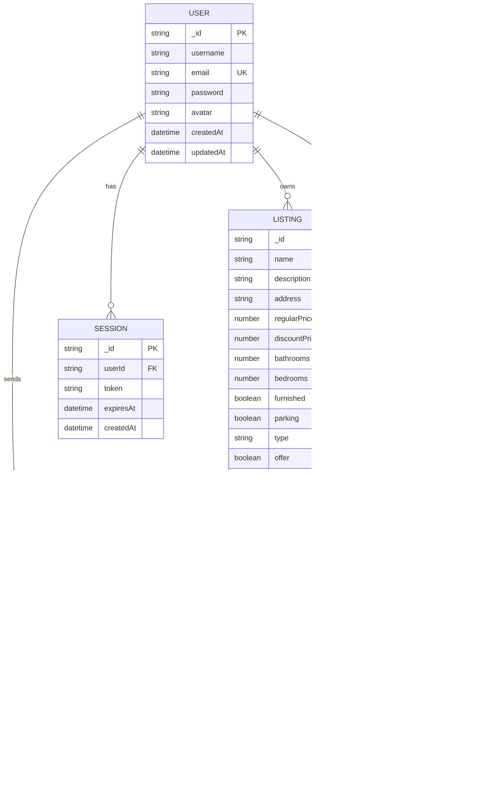

# 🏡 Real Estate MERN Application

A full-stack real estate web application built with the MERN stack that allows users to browse, search, and manage property listings with Google OAuth authentication and advanced search functionality.

## 📖 Project Overview

**Problem Statement:**
Traditional real estate platforms lack user-friendly interfaces and essential features like advanced search and secure authentication.

**Solution:**
A modern, responsive web application that connects property owners with potential buyers/renters through an intuitive interface with powerful search capabilities.

### Key Features
- 🔐 **Secure Authentication** - JWT-based auth with Google OAuth
- 🏠 **Property Management** - Full CRUD operations for listings
- 🔍 **Advanced Search** - Multi-criteria search and filtering
- 📱 **Responsive Design** - Mobile-first approach
- 🖼️ **Image Upload** - Multiple image support with cloud storage
- 💬 **Contact System** - Direct communication with property owners

## � Technology Stack

**Frontend:** React 18, Redux Toolkit, Tailwind CSS, Vite, Firebase Auth
**Backend:** Node.js, Express.js, MongoDB, Mongoose, JWT
**Deployment:** Vercel, MongoDB Atlas, Firebase Storage

## 🏗️ System Architecture


### Architecture Components

#### 1. **Client Layer (Frontend)**
- **Web Browser**: User interface access point
- **React SPA**: Single-page application with component-based architecture
- **Redux Store**: Centralized state management for user auth and app data
- **React Router**: Client-side routing with protected routes

#### 2. **API Gateway**
- **Vercel Edge Network**: Global CDN for fast content delivery
- **Load Balancer**: Distributes incoming requests across servers

#### 3. **Application Layer (Backend)**
- **Express.js Server**: RESTful API server with middleware pipeline
- **JWT Middleware**: Token-based authentication validation
- **CORS Middleware**: Cross-origin request security
- **Route Handlers**: API endpoint management
- **Controller Logic**: Business logic coordination

#### 4. **Business Logic Layer**
- **User Service**: User management and profile operations
- **Listing Service**: Property CRUD operations and management
- **Auth Service**: Authentication and authorization logic
- **File Upload Service**: Image processing and storage
- **Search Service**: Advanced search and filtering logic

#### 5. **Data Layer**
- **MongoDB Atlas**: Primary database for application data
- **Firebase Storage**: Cloud storage for property images
- **Redis Cache**: Caching layer for improved performance

#### 6. **External Services**
- **Google OAuth**: Third-party authentication
- **Firebase Auth**: Authentication service integration
- **Email Service**: Notification and communication
- **Image CDN**: Optimized image delivery

## 🗄️ Database Design (ERD)



### Database Schema Details

#### Users Collection
```javascript
{
  _id: ObjectId,
  username: String (required, unique),
  email: String (required, unique),
  password: String (hashed with bcrypt),
  avatar: String (URL to profile image),
  createdAt: Date,
  updatedAt: Date
}
```

#### Listings Collection
```javascript
{
  _id: ObjectId,
  name: String (required),
  description: String (required),
  address: String (required),
  regularPrice: Number (required),
  discountPrice: Number,
  bathrooms: Number (required),
  bedrooms: Number (required),
  furnished: Boolean (default: false),
  parking: Boolean (default: false),
  type: String (enum: ['sale', 'rent']),
  offer: Boolean (default: false),
  imageUrls: [String],
  userRef: ObjectId (ref: 'User'),
  createdAt: Date,
  updatedAt: Date
}
```

#### Inquiries Collection
```javascript
{
  _id: ObjectId,
  message: String (required),
  userRef: ObjectId (ref: 'User'),
  listingRef: ObjectId (ref: 'Listing'),
  ownerRef: ObjectId (ref: 'User'),
  isRead: Boolean (default: false),
  createdAt: Date,
  updatedAt: Date
}
```

### Database Relationships

1. **One-to-Many**: User → Listings (One user can have multiple listings)
2. **One-to-Many**: User → Inquiries (One user can send multiple inquiries)
3. **One-to-Many**: Listing → Inquiries (One listing can receive multiple inquiries)
4. **One-to-Many**: User → Sessions (One user can have multiple sessions)
5. **Many-to-Many**: User ↔ Listings (Users can favorite multiple listings)

### Indexing Strategy
```javascript
// Performance optimization indexes
db.users.createIndex({ "email": 1 }, { unique: true })
db.users.createIndex({ "username": 1 }, { unique: true })
db.listings.createIndex({ "type": 1, "offer": 1 })
db.listings.createIndex({ "userRef": 1 })
db.listings.createIndex({ "regularPrice": 1 })
db.listings.createIndex({ "createdAt": -1 })
db.listings.createIndex({ "address": "text", "name": "text", "description": "text" })
db.inquiries.createIndex({ "listingRef": 1, "createdAt": -1 })
db.inquiries.createIndex({ "userRef": 1, "isRead": 1 })
db.sessions.createIndex({ "expiresAt": 1 }, { expireAfterSeconds: 0 })
```

## 🛠️ Installation & Setup

### Prerequisites
- Node.js (v18+)
- MongoDB
- Firebase Account

### Backend Setup
```bash
# Clone repository
git clone https://github.com/im-shafiqurrehman/RealEstate-Mern.git
cd RealEstate-Mern/api

# Install dependencies
npm install

# Create .env file with your credentials
MONGO_URI=your_mongodb_connection_string
JWT_SECRET=your_jwt_secret
NODE_ENV=development

# Start server
npm start
```

### Frontend Setup
```bash
cd ../client
npm install

# Create .env file with your Firebase config
VITE_FIREBASE_API_KEY=your_firebase_api_key
VITE_API_BASE_URL=http://localhost:3000/api

# Start development server
npm run dev
```

## 📚 API Endpoints

### Authentication
- `POST /api/auth/signup` - Register user
- `POST /api/auth/signin` - Login user  
- `POST /api/auth/google` - Google OAuth
- `GET /api/auth/signout` - Logout user

### Listings
- `GET /api/listing/get` - Get listings (with filters)
- `GET /api/listing/get/:id` - Get specific listing
- `POST /api/listing/create` - Create listing (Auth required)
- `PUT /api/listing/update/:id` - Update listing (Auth required)
- `DELETE /api/listing/delete/:id` - Delete listing (Auth required)

### Users
- `GET /api/user/:id` - Get user profile (Auth required)
- `POST /api/user/update/:id` - Update profile (Auth required)
- `GET /api/user/listings/:id` - Get user listings (Auth required)

## 🤝 Contributing

1. Fork the repository
2. Create your feature branch (`git checkout -b feature/AmazingFeature`)
3. Commit changes (`git commit -m 'Add AmazingFeature'`)
4. Push to branch (`git push origin feature/AmazingFeature`)
5. Open a Pull Request

## 📄 License

This project is licensed under the MIT License.

## 👨‍💻 Author

**Shafiqur Rehman**
- GitHub: [@im-shafiqurrehman](https://github.com/im-shafiqurrehman)
- LinkedIn: [Shafiqur Rehman](https://linkedin.com/in/shafiqur-rehman)

---

*Built with ❤️ using the MERN Stack*